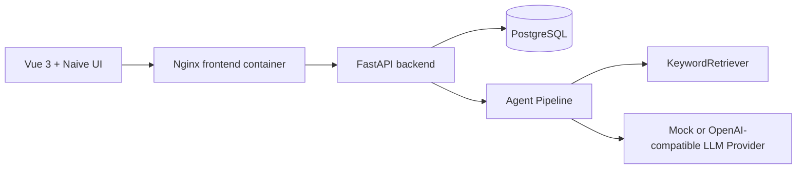

# AI 电商客服与订单售后 Agent 平台

一个面向简历和面试演示的前后端分离项目，用 Mock 数据模拟真实电商客服和订单售后业务。系统围绕一条完整链路展开：用户消息进入客服会话后，Agent 识别意图、查询订单、检索知识库、判断售后规则和风险，生成回复建议，并自动创建人工审核任务、售后工单和节点级运行日志。

## 项目亮点

- AI Agent 不只是聊天：它会查询业务数据、执行规则判断、创建审核任务和工单。
- 节点级可观测：每个 Agent 节点都有输入、输出、状态、错误和耗时日志。
- RAG MVP：基于知识文档 chunk 做简单关键词检索，支持售后政策引用。
- 完整后台：Dashboard、商品、订单、会话、知识库、审核、工单、Agent 日志页面。
- 面试友好：默认 Mock 数据，无需接入真实电商平台或真实 LLM，即可端到端演示。

## 技术栈

- 后端：Python、FastAPI、SQLite、SQLAlchemy、Pydantic、Mock LLM Pipeline、pytest
- 前端：Vue3、Vite、Naive UI、Axios、Vue Router、ECharts
- 数据：SQLite 本地数据库，Demo seed 数据

## 当前功能

- 商品管理：商品列表、搜索、详情
- 订单管理：订单列表、订单详情、物流和售后状态
- 客服会话：发送消息、触发 Agent、展示回复建议/审核任务/工单
- 知识库：文档列表、文档详情、chunk 检索测试
- 人工审核：查看审核任务，通过或驳回
- 售后工单：查看工单，更新处理状态
- Agent 日志：查看 run 列表和节点输入输出 JSON
- Dashboard：核心指标、意图分布、工单状态、最近运行记录

## 快速启动

### 1. 启动后端

```bash
cd backend
python -m pip install -r requirements.txt
python scripts/init_db.py --reset
python -m uvicorn app.main:app --reload --host 127.0.0.1 --port 8000
```

后端 API 文档：

```text
http://127.0.0.1:8000/docs
```

### 2. 启动前端

```bash
cd frontend
npm install
npm run dev
```

前端地址：

```text
http://127.0.0.1:5173
```

## 运行测试

后端测试：

```bash
cd backend
python -m pytest
```

前端构建检查：

```bash
cd frontend
npm run build
```

## 演示流程

1. 打开 `http://127.0.0.1:5173`。
2. 进入“客服会话”页面。
3. 输入或使用默认消息：`我买的耳机有杂音，可以退货吗？`
4. 点击“发送并触发 Agent”。
5. 页面展示：
   - 意图：`return_request`
   - 回复建议
   - 待审核任务
   - `return` 类型售后工单
6. 进入“人工审核”页面，通过或驳回审核任务。
7. 进入“售后工单”页面，更新工单状态。
8. 进入“Agent 运行日志”页面，查看 9 个节点的输入输出。
9. 回到 Dashboard，查看统计指标和图表。

## API 入口

核心接口：

- `GET /api/products`
- `GET /api/orders`
- `GET /api/sessions`
- `POST /api/sessions/{session_id}/messages`
- `GET /api/knowledge/search`
- `POST /api/agent/runs`
- `GET /api/agent/runs/{run_id}/node-logs`
- `GET /api/review-tasks`
- `POST /api/review-tasks/{task_id}/approve`
- `GET /api/tickets`
- `POST /api/tickets/{ticket_id}/status`
- `GET /api/dashboard/summary`

完整 API 可在 Swagger 查看：

```text
http://127.0.0.1:8000/docs
```

## 截图占位

后续可补充以下截图到 `docs/screenshots/`：

- Dashboard 指标和图表
- 客服会话触发 Agent
- 人工审核任务
- 售后工单状态流转
- Agent 节点日志 JSON

## 项目文档

- [PRD.md](PRD.md)：产品需求与业务定位
- [TDD.md](TDD.md)：技术设计、模块拆分、数据表和 API 规划
- [TASKS.md](TASKS.md)：阶段化开发任务与验收标准
- [docs/INTERVIEW_DEMO.md](docs/INTERVIEW_DEMO.md)：3 分钟面试演示脚本

## V1.1 Conversation Center Documents

- [TASKS_ONLINE_V1.1.md](TASKS_ONLINE_V1.1.md): conversation center productization phases.
- [docs/CONVERSATION_CENTER_V1_1.md](docs/CONVERSATION_CENTER_V1_1.md): V1.1 conversation center product model and data-boundary decisions.

## Docker Compose MVP Run

The production-like MVP stack contains PostgreSQL, backend, and frontend.
Copy `.env.example` to `.env`, change `JWT_SECRET_KEY` and database passwords
before any real deployment, then start the stack:

```bash
docker compose up -d --build
```

Initialize demo data explicitly after the services are running:

```bash
docker compose exec backend python scripts/init_db.py --reset
```

Do not automate `--reset` in production. It drops and recreates tables.

Service URLs:

```text
Frontend: http://127.0.0.1:8080
Backend health: http://127.0.0.1:8000/api/health
Backend docs: http://127.0.0.1:8000/docs
```

Useful compose commands:

```bash
docker compose ps
docker compose logs -f backend
docker compose down
```

## Architecture



The application is a single FastAPI backend and a Vue 3 admin console. V1.0
keeps the monolith backend, SQLite for local demo startup, PostgreSQL for
Docker/production-like deployment, and mock LLM behavior by default.

## Tech Stack

- Backend: Python, FastAPI, SQLAlchemy, Pydantic, Alembic, pytest.
- Database: SQLite for local development, PostgreSQL for deployment.
- Agent: node-based pipeline, LLM provider abstraction, Retriever abstraction.
- Frontend: Vue 3, Vite, Vue Router, Axios, Naive UI, ECharts.
- Deployment: Docker, Docker Compose, Nginx.

## Local Startup

Backend:

```bash
cd backend
python -m pip install -r requirements.txt
python scripts/init_db.py --reset
python -m uvicorn app.main:app --reload --host 127.0.0.1 --port 8000
```

Frontend:

```bash
cd frontend
npm install
npm run dev
```

Open `http://127.0.0.1:5173`.

## Default Accounts

| Username | Password | Role |
| --- | --- | --- |
| `admin_demo` | `admin123456` | admin |
| `reviewer_demo` | `reviewer123456` | reviewer |
| `agent_demo` | `agent123456` | agent |
| `viewer_demo` | `viewer123456` | viewer |

## Demo Flow

1. Sign in as `admin_demo`.
2. Open Sessions.
3. Send the default after-sales message and run Agent.
4. Confirm the reply suggestion, review task, ticket, and node logs are created.
5. Open Review Tasks and approve or reject the review.
6. Open Tickets, claim a ticket, change status, and inspect the timeline.
7. Open Agent Logs and inspect node input/output JSON.

## Core API

- `POST /api/auth/login`
- `GET /api/auth/me`
- `GET /api/products`
- `GET /api/orders`
- `GET /api/sessions`
- `POST /api/sessions/{session_id}/messages`
- `GET /api/knowledge/search`
- `POST /api/agent/runs`
- `GET /api/agent/runs/{run_id}/node-logs`
- `GET /api/review-tasks`
- `POST /api/review-tasks/{task_id}/approve`
- `GET /api/tickets`
- `POST /api/tickets/{ticket_id}/status`
- `GET /api/dashboard/summary`
- `GET /api/audit-logs`

## Testing

Backend targeted tests:

```bash
python -m pytest backend/tests/test_phase11_documents.py -v
```

Frontend build:

```bash
cd frontend
npm run build
```

Full backend tests are still available with:

```bash
python -m pytest backend/tests
```

## Additional Design Documents

- [DEPLOYMENT.md](DEPLOYMENT.md)
- [ONLINE_UPGRADE_PLAN.md](ONLINE_UPGRADE_PLAN.md)
- [API_DESIGN.md](API_DESIGN.md)
- [DATABASE_DESIGN.md](DATABASE_DESIGN.md)
- [AGENT_WORKFLOW.md](AGENT_WORKFLOW.md)
- [RAG_UPGRADE_PLAN.md](RAG_UPGRADE_PLAN.md)
